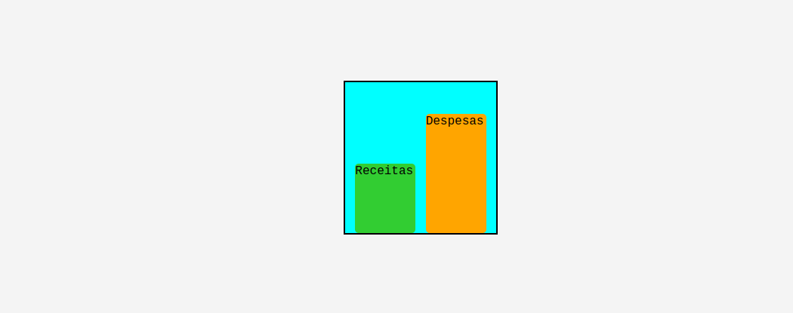

# Tutorial Flaskk

Este Projeto acadêmico visa a criação de um aplicativo de controle financeiro utilizando conceitos de diversos especialistas em economia e finaças de forma simplificada e automatizada.

## 📷 Captura de tela do blg 

 
Pensado como uma ferramenta para adquirir experiência com um framework de desenvolvimento web utilizando python, a conclusão deste projeto possibilita uma gama ilimitada de possibilidades para futuros projetos facilmente escalaveis para cloud computing.

 
Este Projeto segue o que consta no tutorial disponível no site do prório Flask, porém planeja-se um upgrade do projeto para o futuro, com uma estilizaçao de paginas mais elaborada.

###

* [**Tutorial**](https://flask.palletsprojects.com/tutorial/) - Utilizado para elaborar o projeto.

## 🧩 Etapas do projeto:
* Todo projeto será realizado com micro atualizações respeitando a o pensamento filosófico: " Micro mudançãs geram grandes resultados a longo prazo!".

<!-- 

    * A segunda etapa consiste em estruturar o projeto e o repositório para distribuição e teste do projeto. 
    * A terceira etapa consiste em preparar o projeto para implementação em um serviço de hospedagem web tornando-o acessível.
    * Concluído a terceira etapa inicia-se a estilização do projeto de forma mais autonoma com foco em responsividade e explorando novas possibilidades.

    

    ###
    ## 🕹️ Como testar essa aplicação:

    #### Obs.: Assumimos que o Python ja esteja devidamente instalado no computador onde será realizado o teste!

    ### 1 - Crie um diretório para o projeto e acesse-o:

    Obs.: É recomendado a criação de um ambiente virtual para evitar conflitos de versões e dependências ao executar este projeto.

    Segindo as [**instruções de instalação**](https://flask.palletsprojects.com/en/3.0.x/installation/) você pode criar seu ambiente virtual e inicia-lo.

    ### 2 - Clone o repositório:

        $ git clone https://github.com/EbonyWizard4/flask-tutorial.git

    ### 3 - Acesse a pasta do projeto:
        
        $ cd ./flask-tutorial:

    ### 4 - Instale as dependências necessárias:

        $ pip install -r requirements.txt

    ### 5 - Inicialize o banco de dados:

        $ flask --app flaskr init-db
        Initialized the database.

    ### 6 - Instale o aplicativo:

        $ pip install -e .

    ### 7 - Rode o aplicativo:

        $ flask --app flaskr run --debug

    Você verá uma saída semelhante a esta:

        * Serving Flask app "flaskr"
        * Debug mode: on
        * Running on http://127.0.0.1:5000/ (Press CTRL+C to quit)
        * Restarting with stat
        * Debugger is active!
        * Debugger PIN: nnn-nnn-nnn

    ### 8 - Acesse o aplicativo:

    Visite http://127.0.0.1:5000/ em um navegador e você deverá ver o aplicativo em execução.

    ### 9 - Teste a Aplicação:

    Você usará [pytest](https://pytest.readthedocs.io/) e [coverage](https://coverage.readthedocs.io/) para testar e medir seu código. Instale os dois:

        * pip install pytest coverage

    Para executar os testes, use ocomando pytest. Ele encontrará e executará todas as funções de teste:

        * pytest

    Você deve receber uma resposta semelhante a esta:

    

    Se algum teste falhar, o pytest mostrará o erro que foi gerado. 

    Você pode executar o seguinte comando para obter uma lista de cada função de teste em vez de pontos.

        * pytest -v

    Para medir a cobertura de código dos seus testes, use o comando coverage para executar pytest em vez de executá-lo diretamente.

        * coverage run -m pytest

    Ou utilize o coverage para visualizar um relatório simples no terminal

        * coverage report

    Você deve obter uma resposta semelhante a esta:

    

-->
###
## 🛠️ Construído com

As tecnologias utilizadas neste projeto:

* [Python](https://www.python.org/) - A linguagem que possibilitou tudo

* [Flask](https://flask.palletsprojects.com/en/3.0.x/) - O framework que irá pavimentar o caminho

* [SQLite](https://www.sqlite.org/) - O Banco de dados mais simples para começar

<!-- * [GitFlow](https://pypi.org/project/gitflow/) - A melhor forma de organizar o trabalho -->

## ✒️ Autor

*Idealizado e produzido por:* [**Jhone Antonio**](https://github.com/EbonyWizard4)

* **Formação** - *Engenheiro de computação [UNIVESP]*
* **Habilidades** - *Programação e automação*
* **Soft Skills** - *Empatia, Determinação, Garra*
* **Interesses** - *Tecnologias para web e mercado financeiro*
* **Manutenção** - *Ampliação e escalabilidade*

## 🎁 Expresse seu apoio

* Conte a outras pessoas sobre este projeto 📢;
* Convide alguém da equipe para uma cerveja 🍺;
* Um agradecimento publico 🫂;
* Um insentivo financeiro .

---
Editado por [Jhone Antonio](www.linkedin.com/in/antoniojhone)
